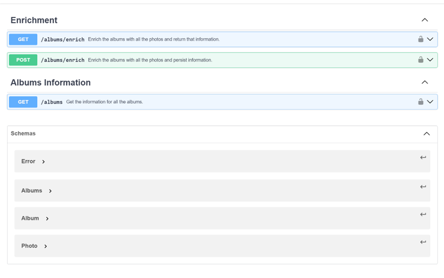
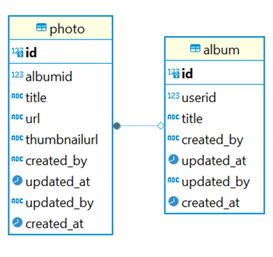

<!-- PROJECT SHIELDS -->
<!--
*** Reference links are enclosed in brackets [ ] instead of parentheses ( ).
*** See the bottom of this document for the declaration of the reference variables
*** for contributors-url, forks-url, etc. This is an optional, concise syntax you may use.
-->
[![Contributors][contributors-shield]][contributors-url]
[![Stargazers][stars-shield]][stars-url]
[![Issues][issues-shield]][issues-url]
[![MIT License][license-shield]][license-url]
[![LinkedIn][linkedin-shield]][linkedin-url]

<!-- PROJECT LOGO -->
 

<h3 align="center">BC Album Enrinchment</h3>

  

    The data enrichment API enables enhancing the requested information from an external API to be stored and queried.
     
    <a href="https://github.com/alvcarpal/bc-album-enrichment"><strong>Explore the docs »</strong></a>
     
     
    <a href="https://github.com/alvcarpal/bc-album-enrichment/blob/master/src/main/resources/demo">View Demo</a>
    ·
    <a href="https://github.com/alvcarpal/bc-album-enrichment/issues">Report Bug</a>
    ·
    <a href="https://github.com/alvcarpal/bc-album-enrichment/pulls">Request Feature</a>
  

<!-- TABLE OF CONTENTS -->

  
Table of Contents

  <ol>
    <li>
      <a href="#about-the-project">About The Project</a>
      <ul>
        <li><a href="#data-model">Data model</a></li>
        <li><a href="#algorithm">Algorithm</a></li>
        <li><a href="#design-patterns">Design Patterns</a></li>
        <li><a href="#built-with">Built With</a></li>
      </ul>
    </li>
    <li>
      <a href="#getting-started">Getting Started</a>
      <ul>
        <li><a href="#prerequisites">Prerequisites</a></li>
        <li><a href="#installation">Installation</a></li>
      </ul>
    </li>
    <li><a href="#license">License</a></li>
    <li><a href="#contact">Contact</a></li>
  </ol>

<!-- ABOUT THE PROJECT -->
## About The Project

The project implements the 'hexagonal' or 'adapters and ports' architecture, aligning with the increasingly prevalent Clean Code paradigm.

Image: Hexagonal architecture representation

There are many benefits to this architecture, but the following should be highlighted:

* Decoupling: The system is divided into layers, and these layers communicate through ports (interfaces) using adapters (implementations), achieving a high level of decoupling between layers.
* Separation of Responsibilities: Three layers—infrastructure, application, and domain—are established, each with a clear objective. 
* Scalability: We can easily add new external elements by simply adding a port and providing an adapter.

We use a Contract First approach, so it is necessary to generate an api.yaml file in src/main/resources/api with the API definition in OpenAPI format (Swagger file).

During the package phase of the Maven lifecycle, the DTOs and controller interfaces will be automatically generated according to the specifications in the src/main/resources/api/api.yaml file. During the clean phase, all auto-generated DTOs and controller interfaces will be deleted.

Image: Endpoints' paths

The endpoints are as follows:

* GET /albums/enrich: Enriches all albums with their photos obtained through the WebClient interface at the endpoints https://jsonplaceholder.typicode.com/albums (album) and https://jsonplaceholder.typicode.com/photos (photo). The enriched information is returned.
* POST /albums/enrich: Enriches all albums, but unlike the previous endpoint, stores the information in the configured datasource and does not return the information.
* GET /albums: Requests all information stored in the datasource.

In addition, openapi code generation plugin should be configured as follows:

    <!-- OpenAPI code generation-->
            <plugin>
                <groupId>org.openapitools</groupId>
                <artifactId>openapi-generator-maven-plugin</artifactId>
                <version>${openapi-generator-maven-plugin.version}</version>
                <executions>
                    <execution>
                        <goals>
                            <goal>generate</goal>
                        </goals>
                        <configuration>
                            <inputSpec>src/main/resources/api/api.yaml</inputSpec>
                            <generatorName>spring</generatorName>
                            <output>./</output>
                            <modelPackage>com.bc.album.infrastructure.rest.spring.dto</modelPackage>
                            <apiPackage>com.bc.album.infrastructure.rest.spring.spec</apiPackage>
                            <modelNameSuffix>Dto</modelNameSuffix>
                            <generateApiDocumentation>false</generateApiDocumentation>
                            <generateModelDocumentation>false</generateModelDocumentation>
                            <generateSupportingFiles>true</generateSupportingFiles>
                            <supportingFilesToGenerate>ApiUtil.java</supportingFilesToGenerate>
                            <configOptions>
                                <sourceFolder>src/main/java</sourceFolder>
                                <java8>true</java8>
                                <interfaceOnly>true</interfaceOnly>
                            </configOptions>
                        </configuration>
                    </execution>
                </executions>
            </plugin>

### Data model

We begin with a scenario in which we have an Album entity and a Photo entity, establishing a one-to-many relationship. In this configuration, an album can accommodate multiple photos.

Imagen: Data model

One of the most crucial aspects for the performance of a service lies in mass operations against a database. In this case, we must emphasize the two operations conducted against the database: the bulk saving of information and the retrieval of all data

* The acquisition of information presented the issue of n+1 queries. Therefore, we make use of JOIN FETCH, specific to queries in the Java Persistence Query Language (JPQL), allowing us to perform a fetch of associated relationships in a single query, thus avoiding the problem known as the 'N+1 queries' issue.

      @Query("SELECT DISTINCT album FROM AlbumDbo album JOIN FETCH album.photos photos")

* For the storage of information, the saveAll method is employed as it is more efficient than parallelize n calls to the save method. An important consideration is that, when receiving external keys directly from the external albums API, we cannot annotate the @Id with @GeneratedValue. This way, Hibernate does not detect that an entity already exists and does not allow information to be updated.

      This point can be debated, as it is not considered a good practice for the primary keys of entities to be provided by a third party, as it cannot be guaranteed that they will be unique.

(<a href="#readme-top">back to top</a>)

### Algorithm

One of the key considerations for optimization was choosing the data structure for the enrichment algorithm. Therefore, it was crucial to avoid recurrently traversing the lists of Albums and Photos. That's why the decision was made to use HashMaps.

* Fast Retrieval: HashMap provides fast retrieval of values based on their keys. The direct mapping of keys to indices allows for constant-time access.
* Efficient Search: Searching for a key in a HashMap is efficient, especially for large datasets. The hashing mechanism minimizes the search space.
* Dynamic Sizing: HashMap dynamically adjusts its size to accommodate varying numbers of elements, ensuring optimal space utilization.

The HashMap (albumMap) directly indexes albums by their ID, thus avoiding the need to traverse the lists multiple times.

(<a href="#readme-top">back to top</a>)

### Design Patterns

During the architecture design, two points were identified where a design pattern could be applied. The following problems were addressed:

* What happens if tomorrow the enrichment algorithm changes or there is a request to add multiple algorithms simultaneously?.
* Similarly, what happens if the external API that returns the data we need to integrate with undergoes a change?.

These two problems highlighted the need to implement mechanisms that follow the open-closed SOLID principle. This way, functionality can be extended without issues, without exposing the existing one.

(<a href="#readme-top">back to top</a>)

####  Strategy pattern

In the Strategy pattern, a family of algorithms is defined, each encapsulated, and made interchangeable. This allows the client to choose the algorithm to use at runtime.

In this particular case, each enricher represents an algorithm that enhances the data differently, and the SelectorEnricher acts as the context that enables selecting and applying the appropriate algorithm at runtime.

Furthermore, the use of a map to manage enrichers by key is an extension of the Strategy pattern and can be considered a variant of the pattern called Registry or Registry of Strategies. In this variant, a registry (in this case, a Map) is used to store and retrieve strategies (enrichers) based on an identifier (key).

In summary, a combination of the Strategy and Registry patterns is being used to implement the data enrichment system.

(<a href="#readme-top">back to top</a>)

####  Factory pattern

A factory is implemented that, based on the provided class, returns a web client for making calls to an endpoint. This design adheres to the SOLID principle of Open-Closed, as it allows for extending the system with new classes (clients) without modifying existing code.

    public static <T> ApiClient<T> createApiClient(Class<T> entityType, RestTemplate restTemplate) {
      if (entityType == Album.class) {
        return (ApiClient<T>) new AlbumApiClient(restTemplate);
      } else if (entityType == Photo.class) {
        return (ApiClient<T>) new PhotoApiClient(restTemplate);
      } else {
        throw new IllegalArgumentException("Unsupported entity type");
      }
    }

The factory is open for extension (new classes can be added), and it is closed for modification (existing code remains unchanged). This design promotes flexibility and maintainability by enabling the addition of new web clients without altering the factory's core logic, showcasing a compliance with the SOLID principles.

A potential improvement to consider is the ability to dynamically configure the URL for each client.

(<a href="#readme-top">back to top</a>)

### Built With

This section should list any major frameworks/libraries used to bootstrap your project. 

* [![JAVA][Java.com]][Java-url]
* [![SPRING][Spring.com]][Spring-url]
* [![SQL][SQL.com]][SQL-url]
* [![GIT][GIT.com]][GIT-url]
* [![HIBERNATE][Hibernate.com]][Hibernate-url]

(<a href="#readme-top">back to top</a>)

<!-- GETTING STARTED -->
## Getting Started

To begin with, the necessary technologies to install are listed, along with instructions on how to start running the project.

### Prerequisites

To be able to run the project locally, you will need to have installed:

* [![JAVA][Java.com]][Java-11-url] 11
* [![GIT][GIT.com]][GIT-url]
* [![INTELLIJ][IntelliJ.com]][IntelliJ-url]

(<a href="#readme-top">back to top</a>)

### Installation

To start the microservice with local configuration, you can execute the following command:

    mvn spring-boot:run -Dspring.profiles.active=local

In the default profile, an integrated H2 database with Flyway has been configured.

If you want to query the H2 database, you can do so through the browser using the following URL:

    http://localhost:8080/h2-console

At the following path, you can find a collection for POSTMAN. Some linters, such as Sonar, may detect sending a token in the Authorization field as a vulnerability, so this should be taken into account.

[![POSTMAN][POSTMAN.com]][POSTMAN-url]

(<a href="#readme-top">back to top</a>)

<!-- LICENSE -->
## License

Distributed under the MIT License. See `LICENSE.txt` for more information.

(<a href="#readme-top">back to top</a>)

<!-- CONTACT -->
## Contact

Álvaro Carmona - [@acarmona](https://www.linkedin.com/in/%C3%A1lvaro-carmona-palomares/) 

Project Link: [https://github.com/your_username/repo_name](https://github.com/alvcarpal/bc-album-enrichment)

(<a href="#readme-top">back to top</a>)

<!-- MARKDOWN LINKS & IMAGES -->
<!-- https://www.markdownguide.org/basic-syntax/#reference-style-links -->
[contributors-shield]: https://img.shields.io/github/contributors/alvcarpal/bc-album-enrichment.svg?style=for-the-badge
[contributors-url]: https://github.com/alvcarpal/bc-album-enrichment/graphs/contributors
[stars-shield]: https://img.shields.io/github/stars/alvcarpal/bc-album-enrichment.svg?style=for-the-badge
[stars-url]: https://github.com/alvcarpal/bc-album-enrichment/stargazers
[issues-shield]: https://img.shields.io/github/issues/alvcarpal/bc-album-enrichment.svg?style=for-the-badge
[issues-url]: https://github.com/alvcarpal/bc-album-enrichment/issues
[license-shield]: https://img.shields.io/github/license/othneildrew/Best-README-Template.svg?style=for-the-badge
[license-url]: https://github.com/alvcarpal/bc-album-enrichment/blob/master/LICENSE.txt
[linkedin-shield]: https://img.shields.io/badge/-LinkedIn-black.svg?style=for-the-badge&logo=linkedin&colorB=555
[linkedin-url]: https://www.linkedin.com/in/%C3%A1lvaro-carmona-palomares/
[Java.com]: https://img.shields.io/badge/Java-ED8B00?style=for-the-badge&logo=openjdk&logoColor=white
[Java-url]: https://www.java.com/es/
[Spring.com]: https://img.shields.io/badge/Spring-6DB33F?style=for-the-badge&logo=spring&logoColor=white
[Spring-url]: https://spring.io/
[SQL.com]: https://img.shields.io/badge/PostgreSQL-316192?style=for-the-badge&logo=postgresql&logoColor=white
[SQL-url]: https://www.postgresql.org/
[GIT.com]: https://img.shields.io/badge/GIT-E44C30?style=for-the-badge&logo=git&logoColor=white
[GIT-url]: https://git-scm.com/
[Hibernate.com]: https://img.shields.io/badge/Hibernate-59666C?style=for-the-badge&logo=Hibernate&logoColor=white
[Hibernate-url]: https://hibernate.org/
[IntelliJ.com]: https://img.shields.io/badge/IntelliJ_IDEA-000000.svg?style=for-the-badge&logo=intellij-idea&logoColor=white
[IntelliJ-url]: https://www.jetbrains.com/idea/download/?section=windows
[Java-11-url]: https://jdk.java.net/11/
[POSTMAN.com]: https://img.shields.io/badge/postman%20-F79114?style=for-the-badge&logo=postman%20pay&logoColor=white
[POSTMAN-url]: https://github.com/alvcarpal/bc-album-enrichment/blob/master/src/main/resource/collection

